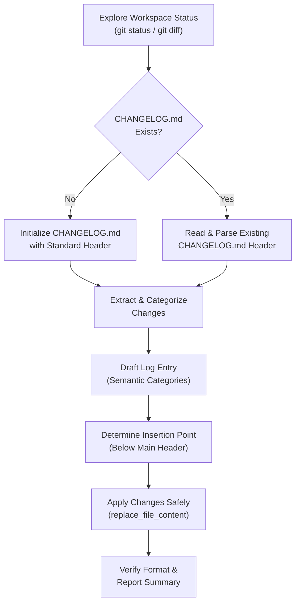

# Changelog Auto-Updater Skill

This developer skill guides AI agents in conducting automated analysis of project modifications, structuring them into professional, human-readable descriptions, and seamlessly merging them into the root `CHANGELOG.md` file.

---

## When to Apply

Invoke this skill:
- **At the end of every task or feature branch** before asking for final user review.
- **Whenever significant files** (e.g., config files, schemas, visual/styles sheets, core controllers) are added or modified.
- **Prior to preparing a release** or version bump.

---

## Workflow Overview

The following diagram illustrates the lifecycle of the automatic changelog update process:



---

## Standard Categories

All changes must be classified under one of these standard sections. Do not create arbitrary headings.

| Category | Description | Examples |
| :--- | :--- | :--- |
| **`### Added`** | New features, scripts, components, templates, assets, or pages. | * "Add drag-and-drop file upload to home dashboard."<br>* "Add Lucide icons support in `renderer.js`." |
| **`### Changed`** | Updates to existing functionality, visual styles, configurations, or dependencies. | * "Refactor state management in `useAudioEngine` for better performance."<br>* "Update `tailwind.config.js` to support true glassmorphism." |
| **`### Fixed`** | Bug fixes, visual alignments, lint resolutions, security holes, or hotfixes. | * "Fix layout shift in thumbnail lists under Chromium."<br>* "Fix memory leak in Tone.js initialization lifecycle." |
| **`### Removed`**| Deleted features, deprecated dead code, or redundant packages. | * "Remove legacy CSS rules from `styles.css`."<br>* "Remove unused `utils.js` script." |
| **`### Security`** | Improvements to authentication, credentials protection, or vulnerability patches. | * "Move sensitive API keys from frontend variables to server-side proxy." |

---

## Detailed Step-by-Step Execution

### Step 1: Analyze Workspace Context

1. **Verify Git Status**:
   Execute standard status commands to identify changed files:
   ```bash
   git status
   ```
2. **Review Diff**:
   Inspect the code changes to understand the technical details and purpose:
   ```bash
   git diff
   ```
   *Note: If some files are untracked (new), examine their content directly.*
3. **List Affected Areas**:
   Create a mental list of files that were:
   - Created (e.g., components, style sheets, configs).
   - Modified (e.g., main scripts, UI files).
   - Deleted (e.g., legacy scripts).

### Step 2: Initialize or Read `CHANGELOG.md`

1. **Check for Existence**:
   Look for `CHANGELOG.md` in the root of the active workspace.
2. **If NOT Present**:
   Create a new `CHANGELOG.md` with the following premium default layout:
   ```markdown
   # Changelog

   All notable changes to this project will be documented in this file.

   The format is based on [Keep a Changelog](https://keepachangelog.com/en/1.1.0/),
   and this project adheres to [Semantic Versioning](https://semver.org/spec/v2.0.0.html).

   ## [Unreleased]

   ### Added
   - Initial repository setup.
   ```
3. **If Present**:
   Read the first 50–100 lines using `view_file` to capture the layout, heading style, and date formatting.

### Step 3: Draft the Entry

1. **Determine Version/Date**:
   - If the project uses Semantic Versioning, check if `package.json`, `Cargo.toml`, or similar version files were bumped.
   - If bumped, use `## [X.Y.Z] - YYYY-MM-DD`.
   - If not bumped or if in an ongoing development phase, use `## [YYYY-MM-DD]` (e.g. `## [2026-05-19]`) or place under `## [Unreleased]`.
2. **Write Bullet Points**:
   - Write clear, concise, user-friendly descriptions.
   - Start each bullet point with an **imperative verb** (e.g., "Add", "Fix", "Update", "Refactor", "Optimize").
   - Mention the specific files or modules affected in code tags (e.g., "in `renderer.js`").
   - **Do NOT** use vague messages like "minor changes" or "update code".
   - **Do NOT** paste raw git commit messages.

### Step 4: Safely Insert the Entry

1. **Locate Insertion Point**:
   The new log entry must go **at the top** of the changelog list, directly under the introductory headers and just above the previous version/date block.
2. **Apply the Edit**:
   Use `replace_file_content` to make a precise insertion.
   *Example target content block:*
   ```markdown
   # Changelog

   All notable changes to this project will be documented in this file.

   The format is based on [Keep a Changelog](https://keepachangelog.com/en/1.1.0/).
   ```
   *Example replacement content block:*
   ```markdown
   # Changelog

   All notable changes to this project will be documented in this file.

   The format is based on [Keep a Changelog](https://keepachangelog.com/en/1.1.0/).

   ## [YYYY-MM-DD]

   ### Added
   - Add new feature X in `main.js`.

   ### Changed
   - Refactor Y style in `styles.css`.
   ```

### Step 5: Verify & Report

1. **Read-back Validation**:
   View the modified file to verify there are no duplicate headings, malformed markdown lists, or lost historical records.
2. **Summarize**:
   Present a clean, high-level summary of the newly added changelog entry to the user.

---

## Anti-Patterns & Pitfalls to Avoid

- ❌ **The "Vague Entry" Pitfall**: Listing entries like `- Fix bug` or `- Update main.js`. Instead, specify *what* was fixed or updated: `- Fix visual overflow in main container on Chromium.`
- ❌ **The "Git Commit Copy-Paste" Pitfall**: Raw commit messages like `git commit -m "wip"` are highly technical and noisy. Always clean and translate them into polished user-facing bullets.
- ❌ **The "Single Category Dump" Pitfall**: Grouping everything under a single header (e.g. all under `Added` even if they are bug fixes). Maintain strict division between `Added`, `Changed`, `Fixed`, etc.
- ❌ **The "History Overwrite" Pitfall**: Accidentally wiping out previous changelog history. Always read and target a precise block of the header to inject your changes, leaving old records intact.
